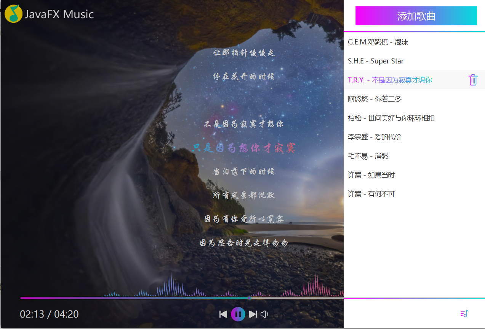
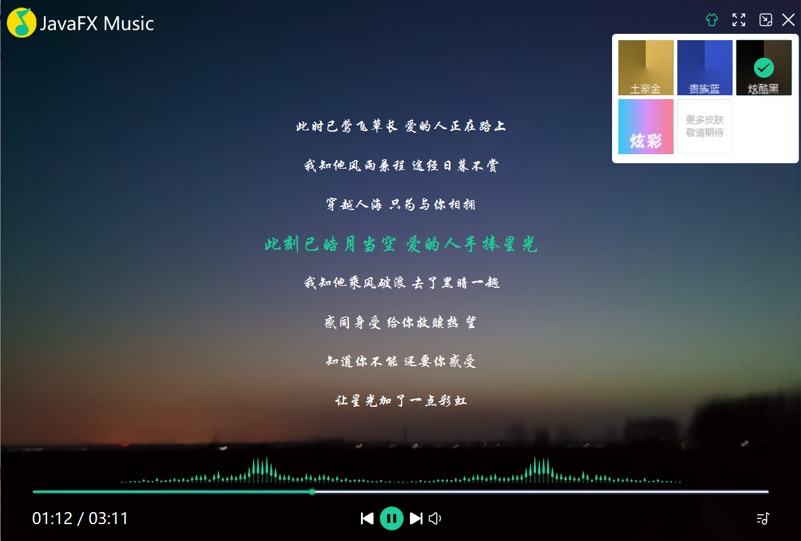

**项目仅仅用于学习javafx使用,请勿用于其他用途;责任自负**  
**The project is only used to learn the use of javafx, please do not use it for other purposes; it is your own responsibility**

B站同步讲解: https://www.bilibili.com/video/BV1XS4y1d7UK  

赵总的javafx交流群: **518914410**
>入群问题: JavaFX是什么?    答案: Java图形界面

Amils老师的javafx交流群: **456378454**
> 入群问题: Java是面向____编程语言?  答案: 对象

素材来源:  
- 图标来自iconfont : https://www.iconfont.cn/
- 图片素材来自网络
- 文件编码判断工具类转摘自 https://www.cnblogs.com/ChurchYim/p/8427373.html

